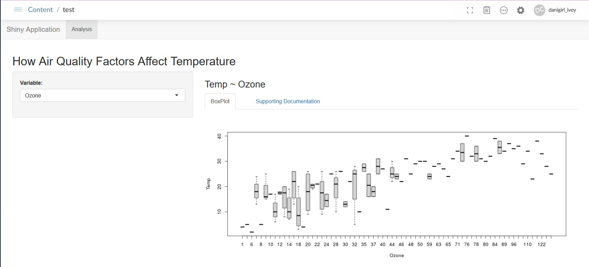

```{r setup, include=FALSE}
knitr::opts_chunk$set(echo = FALSE)
```


## Shiny App



- Uses data from R datasets; airquality
- Use the box labeled Variable to pick an air quality related parameter
- Shows the variables association to temperature. 

##
```{r, echo=FALSE}
head(airquality)
```

##
```{r, echo = TRUE}
library(shiny)

shinyUI(
    navbarPage("Shiny Application",
               tabPanel("Analysis",
                        fluidPage(
                            titlePanel("How Air Quality Factors Affect Temperature"),
                            sidebarLayout(
                                sidebarPanel(
                                    selectInput("variable", "Variable:",
                                                c("Ozone" = "Ozone",
                                                  "Solar Radiation" = "Solar.R",
                                                  "Wind" = "Wind",
                                                  "Month" = "Month"
                                                  )),
                                    ),
                                
                                mainPanel(
                                    h3(textOutput("caption")),
                                    
                                    tabsetPanel(type = "tabs", 
                                                tabPanel("BoxPlot", plotOutput("aqBoxPlot")),
                                                    plotOutput("aqPlot"),
                                                tabPanel("Supporting Documentation"),
                                                h4("Data set is from R datasets, airquality"),
                                                h4("Here you can view box plots of airquality data as it relates
            to temperature. Use the selection panel to choose the variable 
            to see it's relationship to temperature."  ),
                                                h4("This data frame contains 153 observations and 6 variables. Variables
            are Ozone, Solar Radiation, Wind, Temp, Month, and Day."),
                                                       )
                                    )
                                )
                            )
                        )
    )
)

```

##
```{r, echo=TRUE}
library(shiny)
library(datasets)

aqData <- airquality
aqData$Temp <- factor(aqData$Temp)

shinyServer(function(input, output) {
    
    formulaText <- reactive({
        paste("Temp ~", input$variable)
    })
    
    formulaTextPoint <- reactive({
        paste("Temp ~", "as.integer(", input$variable, ")")
    })
    
    output$caption <- renderText({
        formulaText()
    })
    
    output$aqBoxPlot <- renderPlot({
        boxplot(as.formula(formulaText()), 
                data = aqData)    })
    
})
```

